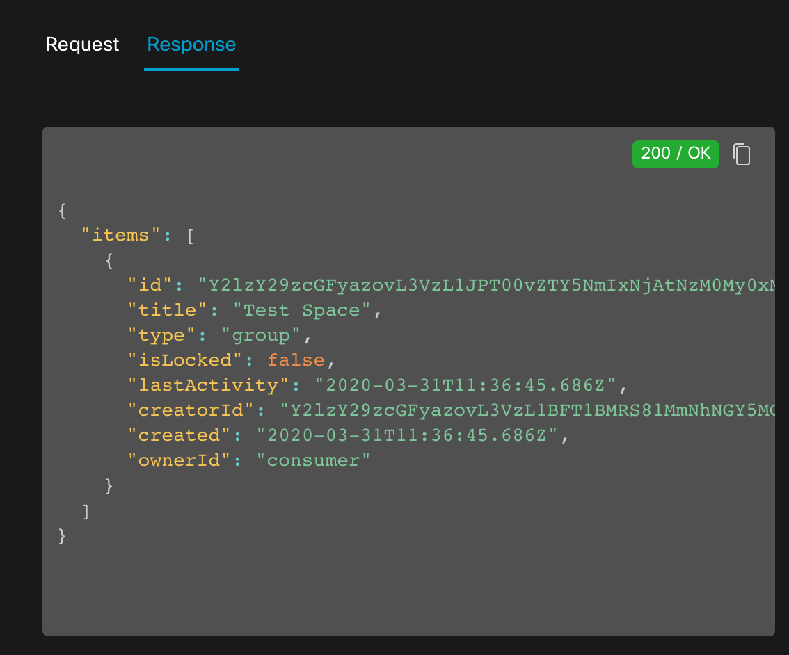
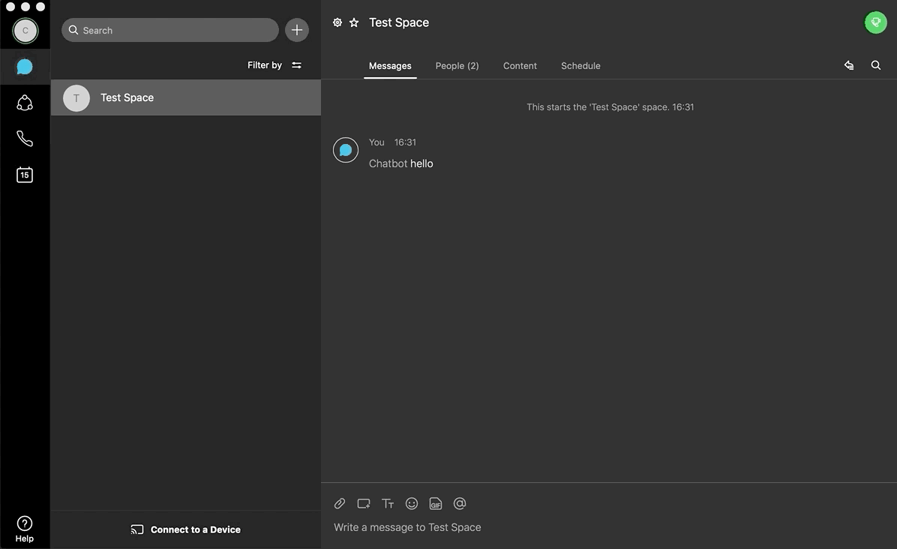

[](https://developer.cisco.com/codeexchange/github/repo/Cpanchal1/Build-Webex-Teams-Chatbot-using-Node-RED)

# Webex Teams ChatBot with Node-RED - Lab Guide

## Getting Started

These instructions will take you through the different tools and platforms used in this lab and provide you with a basic introduction to using the Cisco Webex Teams API and low code environment Node-RED. With the aim of building a simple ChatBot.

__In this lab you will__
1. Create a Chatbot _(Webex Teams Developer Portal)_
2. Create a Teams Space _(Webex Teams Desktop)_
3. Create a Node-RED flow to control your Chatbot _(Node-RED)_

__You will need:__
* A Webex Teams Account
* A Webex Teams Desktop or Browser Client
* An IBM Cloud Account

Ok. Lets get going....

### Registering for Cisco Webex Teams

During this lab we will use the Cisco Webex Teams API to both send and receive messages for the ChatBot we are going to build. To do that the first thing we do is [register](https://www.webex.com/team-collaboration.html) for a free Webex Teams account. Click 'Try Teams free' on the top left corner and complete the sign up process.

### Install the Webex Teams client

Once you've registered you may want to test out Webex Teams by sending and receiving a few messages, as during the lab we'll need to send some messages to the bot we're going to create. To do this we need to have a client. To download the client, follow to the link: https://www.webex.com/downloads.html and click the download button for the __Webex Teams__ client.

Alternatively you can use the web browser client which can be found at: https://teams.webex.com

### Creating an IBM Cloud account 

[Create an IBM Cloud account](https://cloud.ibm.com/registration/standard2) (when prompted, select the location closest to you and the 'Lite' pricing plan, which is free). 

#### Setting up Node-RED on IBM Cloud


Once you've logged in, use the search bar at the top to find the 'Node-RED App'. Click 'Create',  give your Node-RED instance a name (e.g. I named mine 'Node RED WT workshop') and again select location and pricing plans as above. It may take a few minutes to create, so make yourself a cuppa' before we start building!

Once it's built, you can launch your Node-RED instance by visiting:

https://*insert-name-of-your-node-red-instance*.eu-gb.mybluemix.net/. 

If you have any spaces in your instance name, you'll need to replace it with a hyphen '-'. For example, I would use https://node-red-wt-workshop.eu-gb.mybluemix.net/ to access my instance. Once you're there, follow the instructions on Node-RED to create a username and password, and we're ready to get building!

## Creating our Bot in Webex Teams

Now we have our Teams account we have access to the developer site for Webex Teams: https://developer.webex.com. This portal has guides to the Teams API, SDK's available and example projects to help you on your developer journey. We won't go into the details of this site in this lab but we do need to create our bot and get an access token.

Your bot's access token is required to use any of the Webex APIs. In order to create rooms, post a message or retreive any details using Webex Teams APIs, your bot will use this token to authenticate itself. 

To create the bot and obtain its access token, navigate to the 'My Apps' page of your account https://developer.webex.com/my-apps select 'Create New App' and when prompted choose the Bot type then complete the form which asks for Username / Bot Name, Bot Icon and a short description. Once submitted, you will then be given the access token. ***Copy and paste this to another document as we will use it later in the Node-RED steps.***


### Creating a Webex Teams Room
In this section you will create a new Webex Teams space and add your bot to the space.

1. Open Webex Teams and create a new teams space by pressing the "+" sign on the client

3. Give your new space a name 

4. If you have not already added your bot do it now by clicking the dotted button top right and selecting people then use the option to "add people"

5. Type the name of the Bot you created.


COOL! Now you have a teams space and a bot, but it's not very interesting yet. We now need to teach it how to talk and do stuff.

## Creating a Node-RED Flow for your Bot

Now it's time to start to give our bot some intelligence. In this section we will build a flow in Node-RED that will instruct our bot to perform some functions.

We will be using four APIs:

1. For our webhook to send alerts to when someone messages the Bot (we will create this API).
2. To get a joke. 
3. To get the room Id of the Webex Teams room that you created earlier.
4. To post that joke on Webex Teams.

#### Steps 1 - 3: Creating API 1 and a webhook
Once you open Node-RED, you'll see a flow canvas. On the left is a panel of nodes. We'll be using nodes to create our flow. Delete any nodes that were already on the flow canvas when you first launched Node-RED. 


1. First we create an API. This will trigger your flow when messages are sent to our Bot. Select the 'http in' node and fill out the details shown in the example and connect it to a 'http response' node. You can choose what your URL will be, as long as it is preceeded with a forwardslash. (Remember this as we will need it later.) Try keeping the names of nodes descriptive so you remember their purpose in the flow. Click 'Deploy' in the top right to implement these changes. Well done - You've just created an API!

2. Now we need to create a [webhook](https://developer.webex.com/docs/api/guides/webhooks) to connect our flow to Webex Teams. A webhook subscribes to alerts and notifies us each time a certain event occurs. We want to be alerted each time someone messages our bot, so that our flow can be triggered. Go to www.developer.webex.com. Select Documentation -> API Reference -> Webhooks -> Create a Webhook.

3. Here we specify what event we're listening out for. 


* **Authorization** Use the bot's bearer token which you copied earlier

* **name:** Create any name for your webhook

* **targetUrl:** The address you used earlier to launch node-red, followed by the url you wrote in the 'http in' node.

* **resource:** The resource we're listening out for relates to 'messages'

* **event:** When a new message is 'created'

* **filter:** We don't want the Bot to reply to every single message on Webex Teams (that would be annoying!); we only want the bot to respond with a joke when it has been specifically mentioned (e.g. @bot), so we use a filter called 'mentionedPeople'. We set 'mentionedPeople=me', where 'me' refers to the Bot in this case (because we used the Bot's authorization token). 

Click Run to create the webhook. 

You can test that it works by adding a debug node to your flow, clicking 'Deploy' and sending a message to your bot in Webex Teams. The debug node prints things out on the debug panel to the right; it's a great tool for seeing what's going through your flow. The bot won't reply with anything just yet (because we haven't programmed it to) but you'll see in your debug panel that your flow receives an alert. 


Congratulations on completing the first big step! Now that the Bot has a way to be triggered, let's define how it should react.

#### Steps 4 - 5: Retrieving a joke (API 2) 
We will make an API call from your Node-RED flow to icanhazdadjoke.com to retrieve a joke from their database.


4. In order to make this API call, we first need to specify some headers. Create a 'Change' node and fill in the details shown above. We delete the initial payload since the webhook alert itself isn't useful to us for this. We then set the headers using JSON code. You can copy and paste the code below when filling out the 'set msg.headers' field.

```javascript
{
    "Accept": "application/json",
    "User-Agent": "Integration with Webex Teams"
}
```
You can find more information about the headers you need for this API call in the [API documentation](https://icanhazdadjoke.com/api). 

5. Now we can request the joke. Add a 'http request' node and this time, we will use the GET method. Fill in the url where we'll retrieve the joke from and make sure to tick the box that allows us to use the headers from the previous step! 

The response we get from the API call includes the joke, but several other bits of information too, such as a a joke ID and a response code. We want it to return a parsed JSON string because this will make it much easier to access the main part of the API response - the joke itself!


Finally, connect the nodes so that the triggered webhook will set off the process of retrieving a joke. 

You can test that it's working so far by adding a 'debug' node to the end of your flow, clicking 'Deploy' and by sending another message to your bot in Webex Teams (remember to mention the bot using @bot). You should see the response of our API call to icanhazdadjoke in the debug window.


The response is made up of three pieces of information: the joke id, the joke itself and a status code. Later, we'll need to access the joke in order to post it to webex teams.

We can see that the joke itself is stored in a variable called 'joke', which is in an object called 'msg.payload'. The entire thing that's being passed from node to node is called a 'message', or 'msg' for short. Knowing this information, we can access the joke contents by using the variable 'msg.payload.joke'. 

#### Steps 6 - 7 Retrieving Room Id (API 3)

Again, before we can POST to webex teams, we need to define some parameters beforehand, such as what to post and where to post it. We got the 'what' from **API 2**, now let's focus on the 'where'. For this, we will need the room Id of the Webex Teams room you created earlier. 

6. Go to www.developer.webex.com. Click on Documentation -> API Reference -> Rooms -> List Rooms. The API form is populated for you, just press "Run". 



7. Find the room ID associated with the space you created earlier. Like in the example above it's normally the first room. Copy the "id" from the response. For example "Y2lzY29zcGFyazovL3VzL1JPT00vZTY5NmIxNjAtNzM0My0xMWVhLWFhYjItYWYzMjkzZjU4YzIs"
(Remember to remove the quotes).

You are doing great. We are almost there!

#### Steps 8 - 10 Posting to Webex Teams (API 4)
Now we have all the details we need to populate the POST parameters. Here we go with the final few steps!


8. Go back to your Node-RED flow. Use a 'change' node to set the headers, just like we did before. You can find more information on what to include in the headers in the [documentation](https://developer.webex.com/docs/api/v1/messages/create-a-message). Copy and paste the text below, but replace [*token*] with your bot's personal token.
```javascript
{
    "Content-Type": "application/json",
    "Authorization": "Bearer [token]"
}
```

When we want to post something on Webex Teams, the data we want to post needs to be stored in a payload variable called 'text'.

In the same 'change' node we created above, let's add this detail:

9. Add another 'SET' function that takes the joke from msg.payload.joke and saves it in msg.payload.text.


Let's add the roomId. This also needs to be stored in the payload object, but this time in the variable 'roomId'.

10. Add another 'SET' function that stores the room Id you copied in step 7 to the variable 'msg.payload.roomId'. Click 'Done' and ensure the node is linked from the previous 'GET joke' node.


Finally, the very last API call - posting the actual joke!

11. Add the 'http request' node. Set the method to 'POST' and add the following url: https://api.ciscospark.com/v1/messages. Make sure a parsed JSON object is returned.


Click 'Deploy' on the top right corner to implement your code. Now for the exciting bit...

## Testing it All Works

Final reminder - make sure you've clicked 'Deploy' in Node-RED in order to implement the code. Go to your Webex Team desktop client and into the space you created earlier with the Bot in it. Say "hello" to your Bot and...



....drop the mic! You have a working chatbot with integrations.

## Have a Play
Feel free to spend a bit of time understanding the details of this simple Node-RED workflow. Here are a few things you could try:
1. Use the debug node to understand the response from the very first API ('http in' node). Use this to extract and store the roomId, so it doesn't need to be hardcoded later in the flow.
2. Create another webhook that listens out for messages in a 1:1 Webex Teams room and integrate it to your flow.
3. Change what you bot is doing and posting. Why not add some more elements to the workflow, maybe.. send a tweet.

If you are really keen, now you understand the basics of teams, you can scrap Node-RED and code directly against the Webex Teams API yourself. All you need is on the developer.webex.com pages.

## Further resources

Webex is just one of the platforms you have available to you, now you have a Webex Teams account you can use this to access the rest of our Cisco Developer Network and the wealth of tools available. This includes API documentation, walkthroughs and Sandboxes that allow you to get hands on with your code. The Cisco DevNet portal covers numerous technologies including AI/ML, collaboration, IoT and more! To access all this completely free content just follow the link below. and login with one of the options presented. Feel free to use the Webex Teams account that you created earlier!

https://developer.cisco.com/
